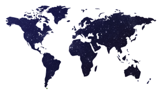
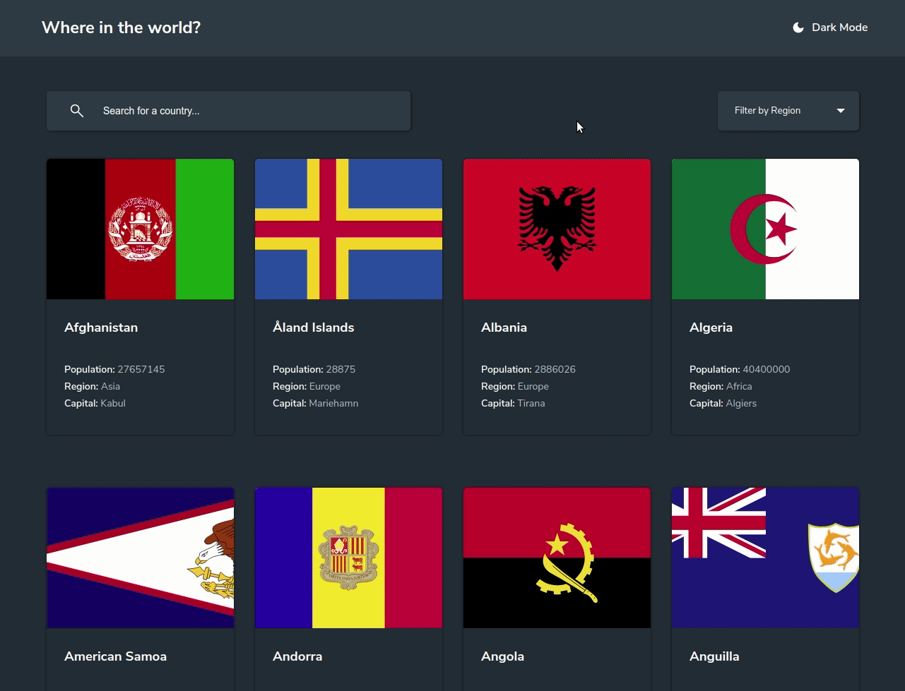
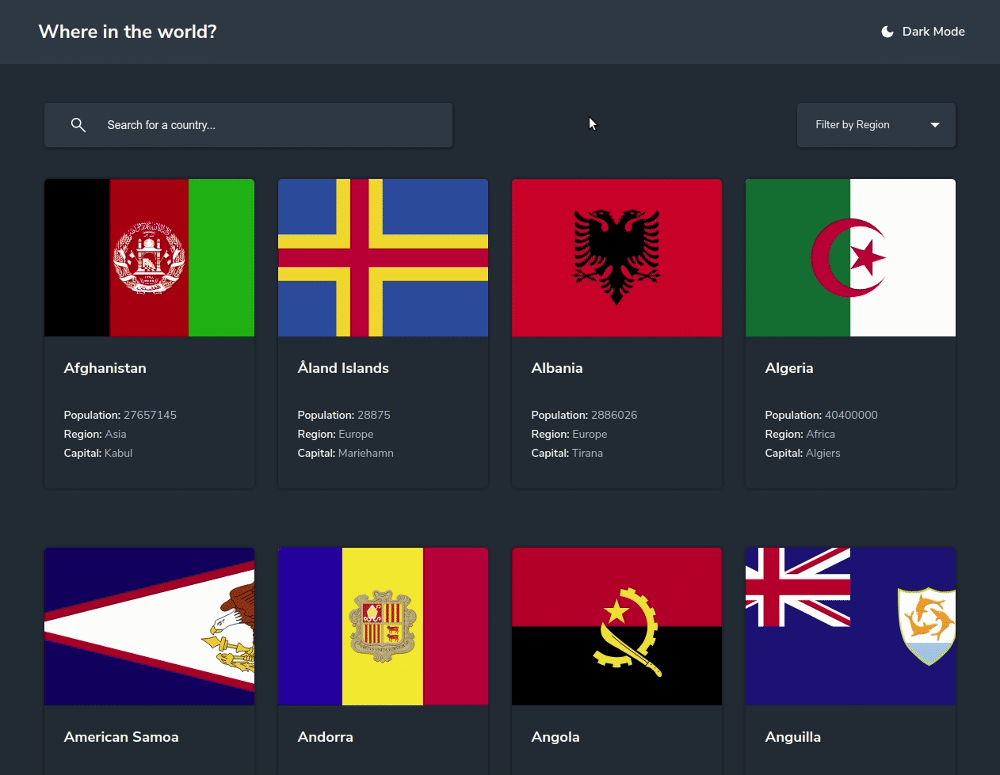

<h1 align="center">

 
Countries around the world
</h1>
<h4 align="center">This is a resolution of the <a href="https://www.frontendmentor.io/">Frontend Mentor</a> Country Rest API challenge. See more about
<a href="https://github.com/lailton-b/search_countries/blob/master/app/README.md">here</a>.
</h4>
 

  

<h3 align="center">Dark mode</h3>
 

  

<h3 align="center">Search for region</h3>
 

  

<h3 align="center">Search by name</h3>
 

  

<h3 align="center">More about the country</h3>
 

  

  

## Technologies

This project was developed with the following technologies:

- [ReactJS](https://reactjs.org/)
- [styled-components](https://www.styled-components.com/)
- [react-router-dom](https://reactrouter.com/)
